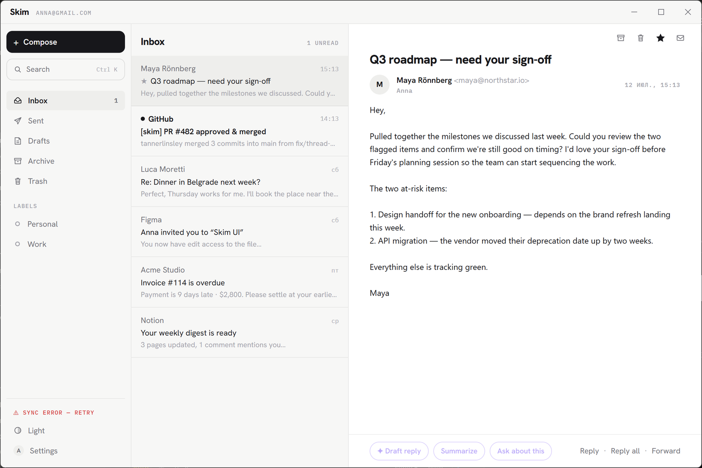
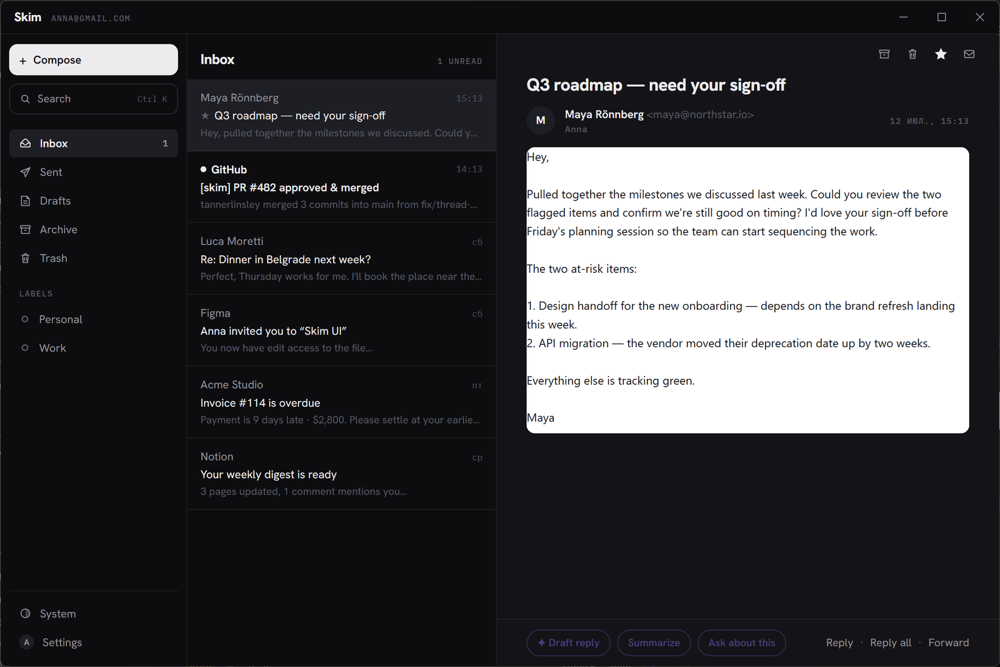

<div align="center">


# Skim

**A free AI email client for Windows that doesn't suck _(that hard)_.**

Minimalist, native, fast. Bring your own AI key for the assistant and co-writer. No subscriptions, free forever.

[](https://github.com/nikserg/skim/actions/workflows/ci.yml)
[](LICENSE)
[](#install)
[](#architecture)
[](https://skim-tech.com)

<br>

<a href="https://github.com/nikserg/skim/releases/latest">
  
</a>

<sub><b>Free & open source · ~5 MB installer · no admin rights needed</b><br>
Grab <code>Skim_x.y.z_x64-setup.exe</code> from the latest release</sub>

<br><br>

<a href="https://skim-tech.com">Website</a> · <a href="https://github.com/nikserg/skim/releases/latest">Download</a> · <a href="https://github.com/nikserg/skim/issues">Report a bug</a> · <a href="CONTRIBUTING.md">Contribute</a>

<br><br>



</div>

---

## Why Skim

Email clients usually come in two flavors: a browser cosplaying as an app, or a monstrous do-everything suite with ICQ-era vibes. Skim is neither:

- ⚡ **Native, not Chromium.** A Rust core with a system WebView2 UI (Tauri 2) — no bundled browser like Electron. The installer is a few megabytes, cold start is instant, idle memory is modest. No admin rights.
- ✂️ **Half the features, cut on purpose.** No calendar, no contacts manager, no rules, no filters, no snooze — none of the stuff you never actually use anyway. Fewer buttons, less cognitive load. Need a do-everything suite? Install Outlook.
- 🎯 **Actions when you need them.** Buttons appear only when they're useful; there's no menu bar at all. Skim's job is to surface the right action at the right moment.
- 🔒 **Local and private by default.** Your mail syncs over IMAP straight into a local SQLite cache. It works offline, search is instant, and nothing ever passes through anyone else's servers. Zero telemetry, zero anal probes.
- ✦ **AI on your terms.** Paste your own key — Anthropic (Claude), or OpenRouter for models from any vendor (Claude, GPT, Gemini, Grok, …) — and Skim drafts in your voice, summarizes threads, answers questions about a message, and chats across your whole mailbox with cited sources. No key? Skim is a great mail client without it. Requests go directly from your machine to the provider; the key lives in Windows Credential Manager.
- 🌍 **11 languages**, light & dark themes, keyboard-first.

<div align="center">

</div>

## Features

**Mail**
- Gmail, Outlook, Yahoo, iCloud, or any IMAP/SMTP server (autoconfig for the big ones)
- Google sign-in via OAuth (loopback + PKCE) or app password
- Conversation threading (References/In-Reply-To with subject fallback)
- Archive, delete, star, read/unread — all optimistic with a durable offline queue: act instantly, Skim syncs when the network returns
- IMAP IDLE push + periodic polling; new-mail notifications with a mark-read quick action
- Lives in the tray: closing the window keeps mail syncing in the background; starts with Windows minimized (both optional)
- Compose, reply, reply-all, forward with proper threading headers
- Attachments: open, save; inline images served from the local cache

**Speed**
- Instant full-text search (SQLite FTS5) over subject, sender, recipients, and bodies
- `Ctrl+K` command palette: search-as-you-type, jump to folders, every command
- Keyboard shortcuts: `j`/`k` move · `e` archive · `#` delete · `s` star · `u` unread · `r` reply · `Ctrl+N` compose · `/` search

**AI (bring your own key)**

There's no "Skim Pro" subscription and there never will be. Paste your own key and the ✦ violet buttons come alive:

- **Drafts in your voice** — tell it what to say and get a finished, first-person email. Skim can analyze up to ~100 of your sent messages and match how you write — greetings, sentence length, punctuation. It replies in the *sender's* language, even one you don't speak
- **Refine in dialogue** — “shorter”, “add a deadline”, “drop the exclamation marks”. Each tweak lands on the current draft, keeping everything you didn't ask to change; your hand-edits are respected too
- **Ask about an email** — question one message or the whole thread (up to 25 emails in context), with follow-ups. Answers come only from the content — if it's not in the conversation, it says so
- **Mailbox chat** — ask “which invoices are still unpaid this month?” in the palette; Skim retrieves the relevant mail (FTS5/bm25) and answers with the source emails cited as clickable chips
- **AI Recap** — one click digests up to 20 unread emails, what-needs-a-reply first with deadlines and cited sources, and marks them read
- **Context-aware** — every prompt carries the current date, weekday, time, your timezone, your UI language, and the relevant thread. “Reply that I'll make it by Friday” becomes a concrete date
- **Your writer profile** — set your name, pick a style (formal / friendly / concise / witty / enthusiastic) or “write exactly like me”, and give standing instructions (“sign as Nick”, “my company is called…”)
- **Two providers** — Anthropic directly (Claude Sonnet 5 default, Opus 4.8, Haiku 4.5) or OpenRouter with one key for every vendor: Claude, GPT, Gemini, Grok, or any model slug you type in

Your key, your bill: Skim talks to the provider's API directly and adds no markup, no proxy, no accounts. The key is stored in Windows Credential Manager.

**Privacy & security**
- HTML email is sanitized in Rust (ammonia) and rendered in a sandboxed iframe with a strict CSP — scripts never run
- Remote images blocked by default, with one-click per-sender allow
- Passwords, OAuth tokens, and your API key live in Windows Credential Manager — never in the database, never in a config file

## Install

Download the latest installer from **[Releases](https://github.com/nikserg/skim/releases)** — the `.exe` (NSIS) installs per-user without admin rights; an `.msi` is also published for managed environments.

Requirements: Windows 10/11 with [WebView2](https://developer.microsoft.com/microsoft-edge/webview2/) (preinstalled on Windows 11).

## Connecting your mail

### Gmail — one click

Press **Continue with Google** during onboarding. Skim opens your browser, you approve access, done. Skim never sees your password; the OAuth token is stored in Credential Manager.

> **Note for source builds:** Google requires each app distribution to register its own OAuth client. Official installers ship with the project's client ID. If you build from source, either paste your own client ID in the connect screen (see below) or use an app password.

### Gmail / Yahoo / iCloud / Outlook — app password

These providers require an *app password* for IMAP:

1. Enable 2-step verification on your account.
2. Create an app password ([Gmail](https://myaccount.google.com/apppasswords) · [Yahoo](https://login.yahoo.com/account/security) · [iCloud](https://account.apple.com/account/manage) · [Outlook](https://account.live.com/proofs/AppPassword)).
3. Enter your address and the app password in Skim. Server settings fill themselves in.

### Any other server

Enter your address and password; adjust the IMAP/SMTP hosts under “Server settings” if the guess is wrong. Implicit TLS (:993) for IMAP, STARTTLS (:587) or TLS (:465) for SMTP.

### Registering your own Google client ID <a name="own-client-id"></a>

For forks and source builds (~15 minutes, free):

1. [console.cloud.google.com](https://console.cloud.google.com) → create a project.
2. *APIs & Services → Enable APIs* → enable **Gmail API**.
3. *Google Auth Platform* → configure the consent screen (External).
4. *Data access* → add the scope `https://mail.google.com/`.
5. *Clients* → create an **OAuth client ID** of type **Desktop app**.
6. Paste the client ID (and secret) into Skim's connect screen, or bake them into your build via the `SKIM_GOOGLE_CLIENT_ID` / `SKIM_GOOGLE_CLIENT_SECRET` env vars.

While your Google app is unverified it runs in *testing* mode: only listed test users can sign in and refresh tokens expire weekly. App passwords have no such limits.

## Enabling AI

1. Get an API key from either provider:
   - **Anthropic** — [console.anthropic.com](https://console.anthropic.com/settings/keys) (Claude, straight from the source)
   - **OpenRouter** — [openrouter.ai](https://openrouter.ai/settings/keys) (one key for Claude, GPT, Gemini, Grok, and hundreds more — pick a suggested model or type any `vendor/model` slug)
2. Paste it in onboarding (step 2) or later in **Settings → Skim AI**, on the provider's tab.
3. That's it — the ✦ violet buttons light up.

Your key, your bill: Skim talks to the provider's API directly and adds no markup, no proxy, no accounts. The key is stored in Windows Credential Manager and can be removed in one click.

## Keyboard shortcuts

| Key | Action |
|---|---|
| `Ctrl K` / `/` | Command palette / search |
| `Ctrl N` | New message |
| `j` / `k` | Next / previous conversation |
| `e` | Archive |
| `#` / `Delete` | Delete |
| `s` | Star / unstar |
| `u` | Mark unread |
| `r` | Reply |
| `Esc` | Close / deselect |

## Building from source

Prerequisites:

- [Node.js 20+](https://nodejs.org)
- [Rust (stable, MSVC)](https://rustup.rs)
- Visual Studio Build Tools with the **Desktop development with C++** workload:

```powershell
winget install Microsoft.VisualStudio.2022.BuildTools --override "--quiet --wait --add Microsoft.VisualStudio.Workload.VCTools --includeRecommended"
winget install Rustlang.Rustup
```

Then:

```powershell
npm install
npm run tauri dev      # develop with hot reload
npm run tauri build    # produce NSIS + MSI installers in src-tauri/target/release/bundle/
```

## Architecture

```
┌───────────────────────────────┐      IMAP/SMTP (rustls)      ┌──────────────┐
│  Svelte 5 UI  (WebView2)      │◄──── sync engine ───────────►│  your mail   │
│  3 panes · palette · composer │                              │  server      │
├───────────────────────────────┤      HTTPS (your key)        └──────────────┘
│  Rust core  (Tauri 2)         │◄──── AI features ───────────► api.anthropic.com
│  sync · sanitize · ops queue  │
├───────────────────────────────┤
│  SQLite + FTS5  (local cache) │   passwords & keys → Windows Credential Manager
└───────────────────────────────┘
```

- **Sync**: per-account engine over one worker IMAP session — newest-first header windows, incremental fetches above the UID high-water mark, flag/expunge reconciliation, UIDVALIDITY recovery. A second connection IDLEs on INBOX for push.
- **Every action is offline-first**: archive/delete/star/send are applied locally at once and queued in SQLite (`pending_ops`); the queue drains with retries whenever the server is reachable.
- **HTML mail** is sanitized in Rust before it ever reaches the UI, then rendered in a no-script sandboxed iframe.
- **AI** requests are assembled in Rust (mailbox chat retrieves context via FTS5/bm25) and streamed to the UI token by token.

## Localization

English, Русский, Srpski, Français, Deutsch, Español, Italiano, Polski, 中文, 日本語, 한국어 — switchable at runtime, no restart. Translations live in [`src/lib/i18n/locales/`](src/lib/i18n/locales); fixes from native speakers are very welcome ([how to contribute](CONTRIBUTING.md#translations)).

## Deliberately not included

Skim stays small on purpose: no calendar, no contacts manager, no rules/filters, no snooze, no read receipts, no tracking pixels of its own. One account per install for now (multi-account is on the roadmap). If you need everything, there are battleships; if you need speed, there's Skim.

Known limitations: Windows Snap Layouts don't pop over the custom maximize button (Tauri frameless-window limitation); self-signed IMAP certificates are rejected rather than click-through-able — by design.

## Contributing

Bug reports, patches, and translation fixes are welcome — see [CONTRIBUTING.md](CONTRIBUTING.md). The short version: keep it small, keep it fast, run `cargo clippy` and `npm run check` before pushing.

## License

[MIT](LICENSE) © Skim contributors
